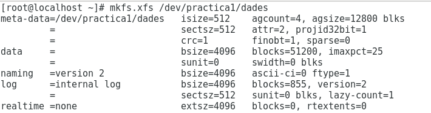

# Gestió de Volums Lògics
### Descripció:   
  -  Logical Volume Management (LVM) es una capa de abstracción entre un dispositivo de almacenamiento (por ejemplo un disco)
  y un sistema de ficheros.  

### Què volen dir les sigles, definició, analogies i exemples de comandes (explicant què fan) vistes a classe de:  
  - PV: Physical Volume (Volumen fsico), identificación de discos. Es un dispositivo de almacenamiento 
  (Puede ser un disco duro, una partición, una tarjeta SD, un floppy, un dispositivo RAID.
  ```  
  pvcreate (Crear un volum fsic)
  pvs (Veure els volums fsics creats)
  ```  
  
  - VG: Volume Group (Grupo de volúmenes), discos virtuales. Un VG es un “disco” compuesto de uno o más PVs, a diferencia 
  del disco real, este puede aumentar su tamaño (crecer) añadiéndole más PVs.
  ```  
  vgcreate (Crear un volum de grup)
  vgs (Per veure els grups de volums creats)
  ```  
  - LV: Logical Volume (Volumen Lógico), particiones. Los LVs serían las particiones del VG.
  ```  
  lvcreate (Crear un volum lògic)
  lvs (Veure els volums lògics creats)
  lvextend (Ampliar o disminuir les particions)
  ```  
  
### Entorn de pràctiques: 
Per fer les pràctiques utilitzarem el Virt Manager per crear una màquina virtual, en el meu cas Fedora, amb la bombeta afegirem el Hardware, 3 discs de 200M (0,2G) tipus Virtio, guardem i encenem la màquina, a terminal si fem un **lsblk** podem comprovar que els discs de 200M s'han creat correctament amb els noms: vda, vdb, vdc. Podem començar les pràctiques.  

#### Pràctica 1:  
- Primer es crea el volum físic :
```
pvcreate /dev/vda
```
- Després el grup de volums : (Practica 1 ès el nom del volum)
```
vgcreate practica1 /dev/vda
```
- A continuació es crea el volúm lògic (partciió): (-l es el tamany, en aquest cas , la total capacitat del disc.)
```
lvcreate -l 100%FREE -n dades practica 1
```  
---

---
#### Pràctica 2:  
- Creem un sistema de fitxers xfs al volum creat : **mkfs.xfs /dev/practica1/dades**
```  
mkfs.xfs /dev/practica1/dades
```  
- Muntatge : 
```  
mount /dev/practica1/dades  /mnt
```  
- Dintre de /mnt creem un fitxer de 180M : 
```  
dd if=/dev/zero of=test.img bs=1k count=180000
```  
---



---

#### Pràctica 3:   
- Creació RAID 1 als dos discos sobrants :
```  
mdadm --create md0 --level=1 --raid-devices=2 /dev/vdb /dev/vdc
```  
---

---

#### Pràctica 4:  
- Ampliem el volum lògic de dades al raid que acabem de crear :
```  
pvcreate /dev/md0
vgextend practica1 /dev/md0
lvextend -L +200M /dev/practica1/dades
```  
---


---

#### Pràctica 5:  
- Fem un resize del sistema de fitxers : 
```  
xfs_growfs /dev/practica1/dades
```  
- Entrem a /mnt : 
```  
cd /mnt
```  
- Creem un nou fitxer de 180M : 
```  
dd if=/dev/zero of=test2.img bs=1k count=180000
```  
---


---
