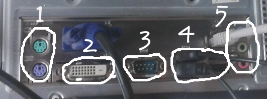

# M1 CONNECTORS EN UN ORDINADOR

*Feu una foto del panell de connectors posterior del vostre ordinador i identifiqueu-hi quin connector és cadascún.*

 1.Port del ratolí i del teclat  
 2.DVI   
 3.Port sèrie  
 4.USB(Universal Serial Bus)  
 5.Connectors Audio

